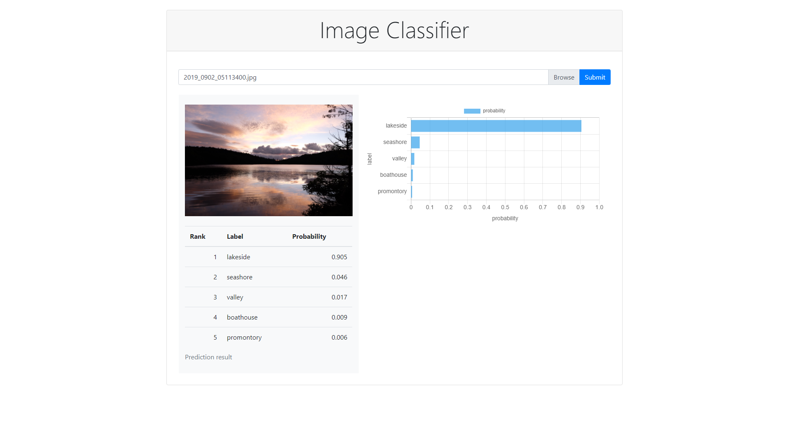

# Image Recognition App

Image Recognition App is an image classification application using Django and PyTorch.




## Requirements

* OS: Windows10 Pro (It will probably also work with Linux, but has not been tested yet.)
* CPU only (not support GPU)
* Python 3.8


## Installation

```bash
$ git clone https://github.com/noriho137/image-classifier.git
$ cd image-classifier/
$ python -m venv {venv_name}
$ {venv_name}/Scripts/activate.bat
({venv_name}) $ pip install -r requirements.txt
```


## Download pretrained model and label definition

### Pretrained model

This application use pytorch pretrained model.
For example, following models are available.

|Name|URL|
|:---|:---|
|alexnet|https://download.pytorch.org/models/alexnet-owt-4df8aa71.pth|
|densenet201|https://download.pytorch.org/models/densenet201-c1103571.pth|
|googlenet|https://download.pytorch.org/models/googlenet-1378be20.pth|
|inception_v3|https://download.pytorch.org/models/inception_v3_google-1a9a5a14.pth|
|mobilenet_v2|https://download.pytorch.org/models/mobilenet_v2-b0353104.pth|
|resnet50|https://download.pytorch.org/models/resnet50-19c8e357.pth|
|squeezenet1_0|https://download.pytorch.org/models/squeezenet1_0-a815701f.pt|
|vgg16|https://download.pytorch.org/models/vgg16-397923af.pth|


### Label definition

This model need class label definition ```imagenet_class_index.json``` from 
https://s3.amazonaws.com/deep-learning-models/image-models/imagenet_class_index.json .


## Generate Django secret key

Generate Django secret key by ```secrets.token_urlsafe```.

```bash
({venv_name})$ python -c "import secrets; print(secrets.token_urlsafe(38))"
```


## Set up environment variables

Make ```.env``` file at project root directory and define environment variables like following:

```bash
# Django settings
export DJANGO_SECRET_KEY={Django secret key generated above}
export DJANGO_DEBUG=True

# Classification model
export PRETRAINED_MODEL_NAME=vgg16
export PRETRAINED_MODEL_PATH=./pretrained/vgg16-397923af.pth
export CLASS_INDEX=./pretrained/imagenet_class_index.json
export MAX_RANK=5
```


## How to run

```bash
({venv_name})$ python manage.py migrate
({venv_name})$ python manage.py runserver
```

Browse to http://127.0.0.1:8000/ .
